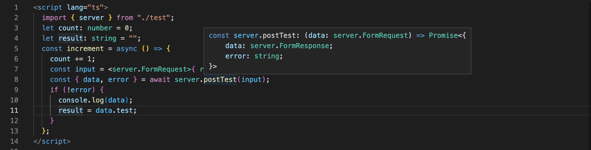

# ts-rpc

#### typescript RPC

---

##### The ghost bridge from front-end to backend

This project is a POC - Proof of concept.
The goal is to generate typescript code from golang using AST.
So you can use intellisense in the development IDE.

## 

---

[Golang types traslation](docs/TsGoTypes.md)

[Typescript: TSDeclaration](docs/TsDeclaration.md)

[Typescript: TStype](docs/TsType.md)

[Typescript: interface](docs/TsInterface.md)
[Struct tags](docs/TsTags.md)

[Typescript: TsEndpoint](docs/TsEndpoint.md)

[Typescript: const](docs/TsConst.md)

[Typescript: enum](docs/TsEnum.md)

---

#### Server Examle

[server examle](docs/TsExportEndpoints.md)

---

#### Can I use it/contribute?

Sure, but you should probably start your own from scratch. I built this in about one week and it was an interesting experience, I recommend you do the same. My goal was never to make good or reusable code, so it's neither good nor reusable. If you do decide to work on such a system, I would suggest adding the following:

- Talk about ghost bridge over all the world
- Suggest some ideas
- Develop good reusable code
- Add tests, comments and GoDoc
- Be Happy

#### Alright then...

Cool. I'm on linkedin Golang nuts group https://www.linkedin.com/groups/3712244/
My linkedin page: https://www.linkedin.com/in/fabio-prada-a9159b75/
Discord channel #tsrpc: https://discord.com/channels/1046004205556617237/1046004333734531092

ciao

